<link rel="stylesheet" type="text/css" href="cast-web-preset-generator/semantic-ui/semantic.min.css">

# cast-web installation guide
## Prerequisites
- Device that runs node.js and static IP
- Smartthings hub
- Google Cast enabled device

Due to the limitations of the Smartthings platform all Google Cast requests (SOCKETS) need to be proxied through an HTTP server. This web API is written for node.js and should be running on your local network. A cloud installation is probably somehow possible, but not recommended!
## Setting up the API
Install node.js, then install the API as described in the [documentation](https://github.com/vervallsweg/cast-web-api#installation "documentation"). Please make sure that the device running the API has a STATIC or fixed IP address. Otherwies you would have to go in to the service manager change the host IP and tap the update button everytime it changes.  
## Installing the DTH and service manager

  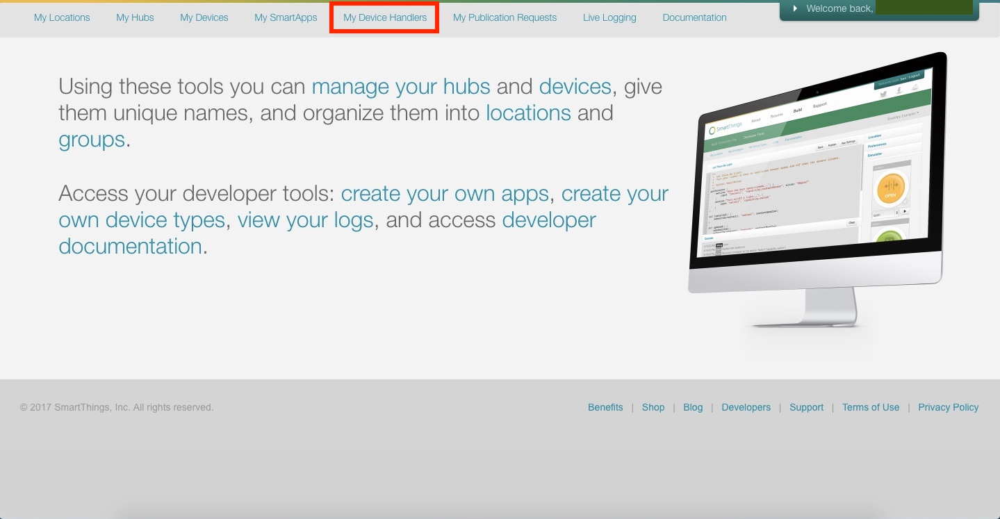
  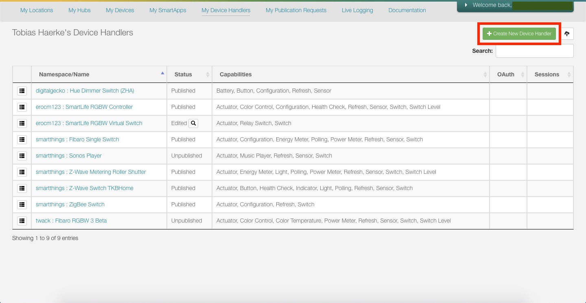
  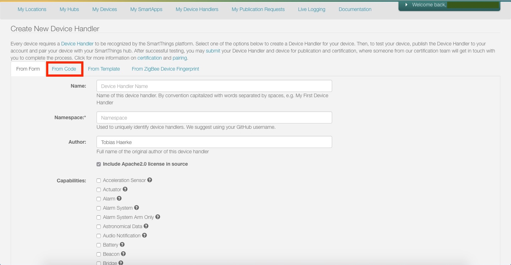
  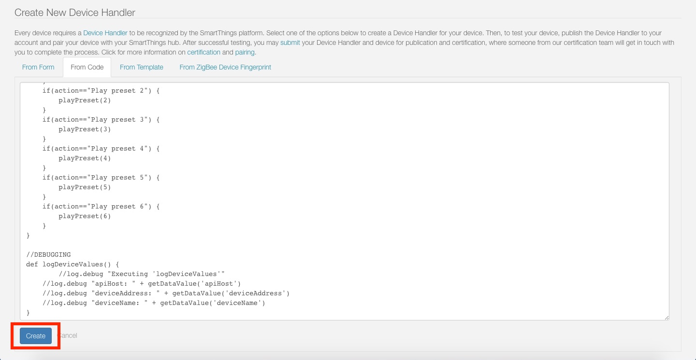
  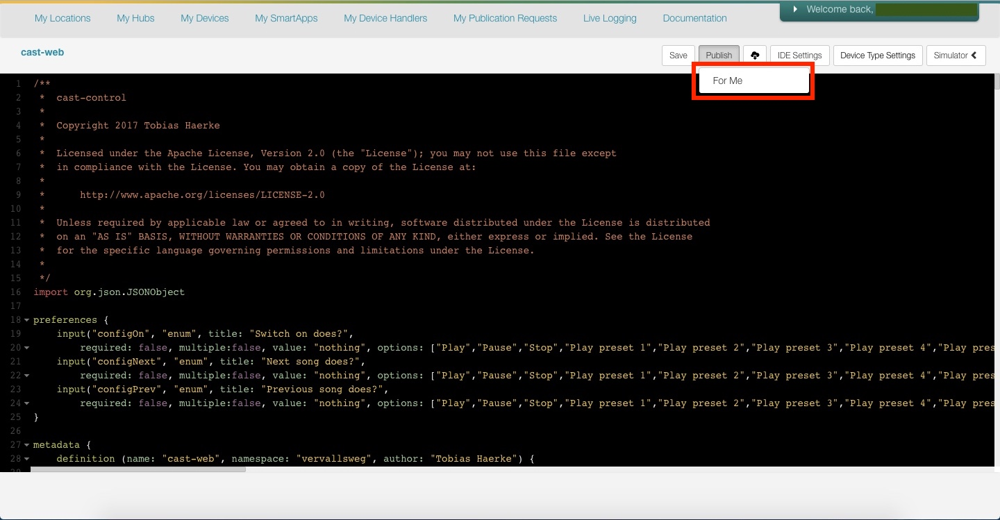

First copy the device the device type handler's groovy code from [here](https://github.com/vervallsweg/smartthings/tree/master/device-handlers/cast-web "here"). Open the Smartthings IDE, log in > 'My Device Handlers' > '+ Create New Device Handler' > 'From Code' > paste the code from clipboard > 'Create'.

  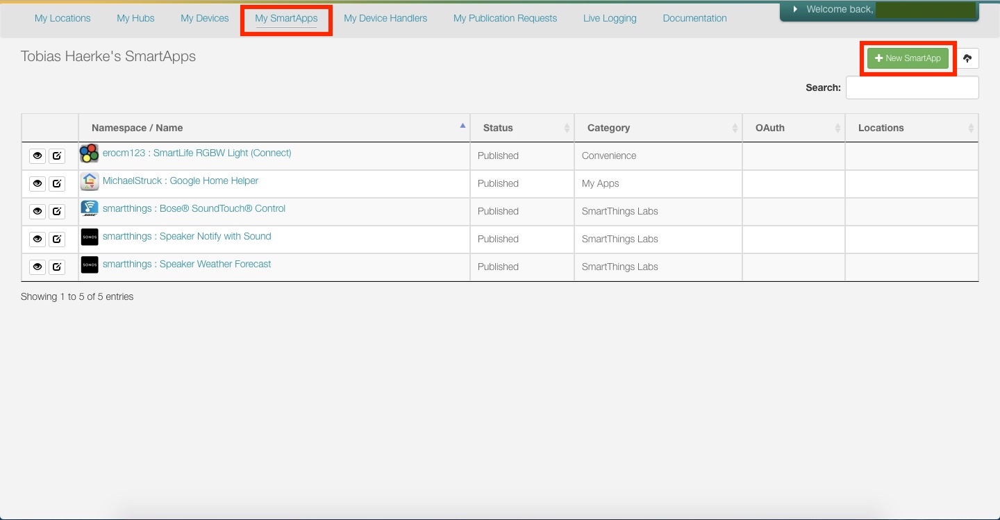
  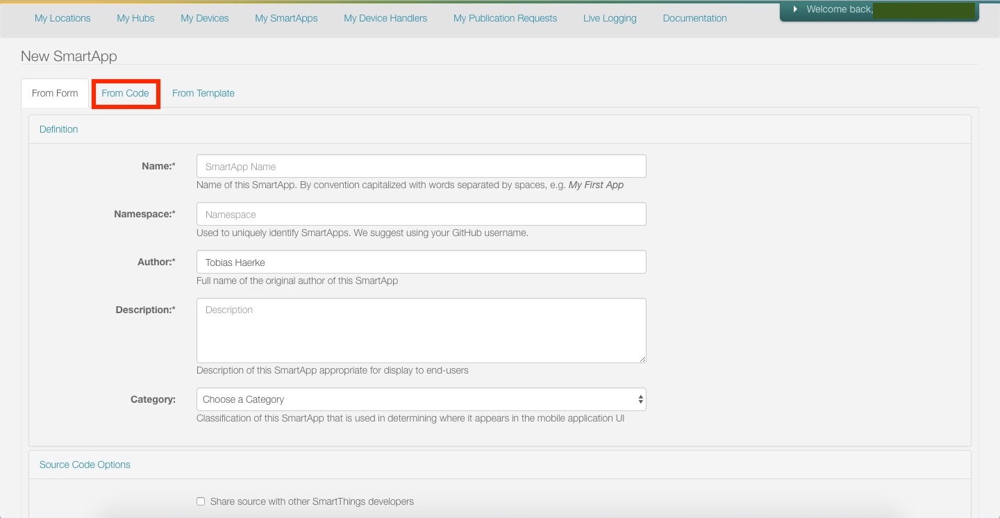
  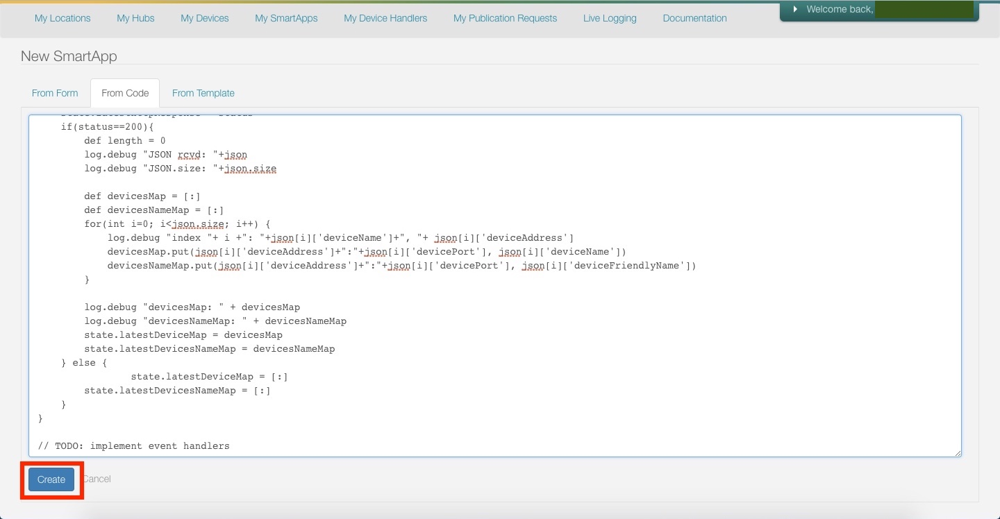
  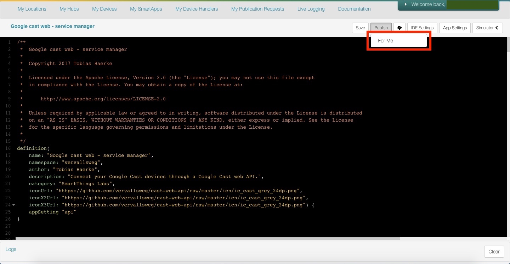

Second copy the service manager's groovy code from [here](https://github.com/vervallsweg/smartthings/tree/master/smartapps/google-cast-web-service-manager "here"). Open the IDE > 'My SmartApps' > 'New SmartApp' > 'From Code' > paste the code from clipboard > 'Create'.

Done!

  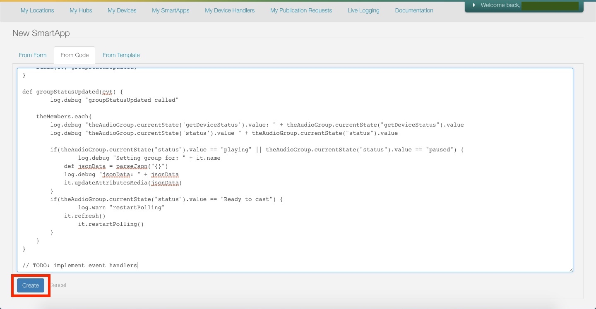
  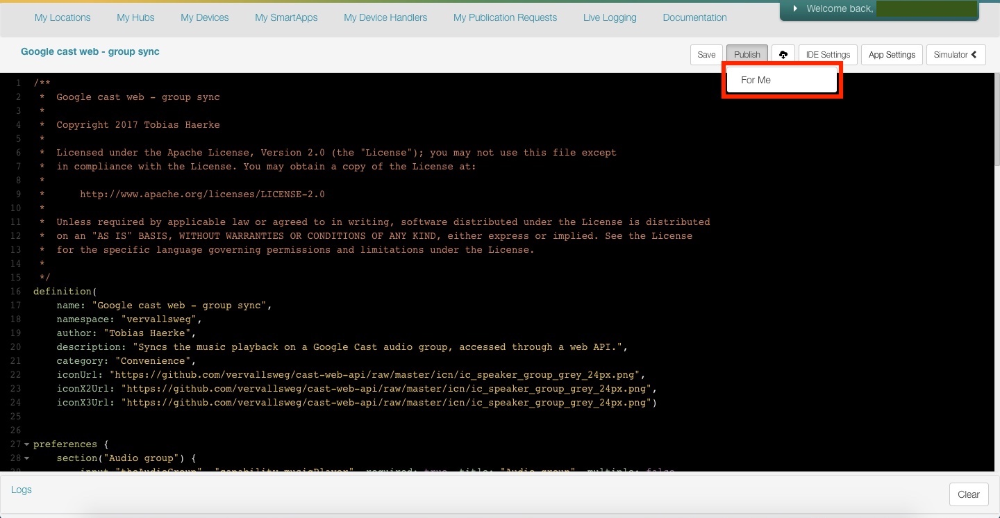

If you have Google Cast audio groups and would like to use them install the google-cast-web-group-sync. Copy the code from [here](https://github.com/vervallsweg/smartthings/tree/master/smartapps/google-cast-web-group-sync "here"). Open the IDE > 'My SmartApps' > 'New SmartApp' > 'From Code' > paste the code from clipboard > 'Create'.
## Setting up your devices

  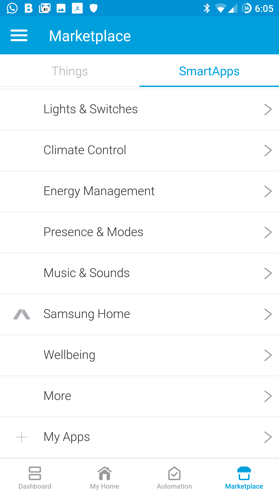
  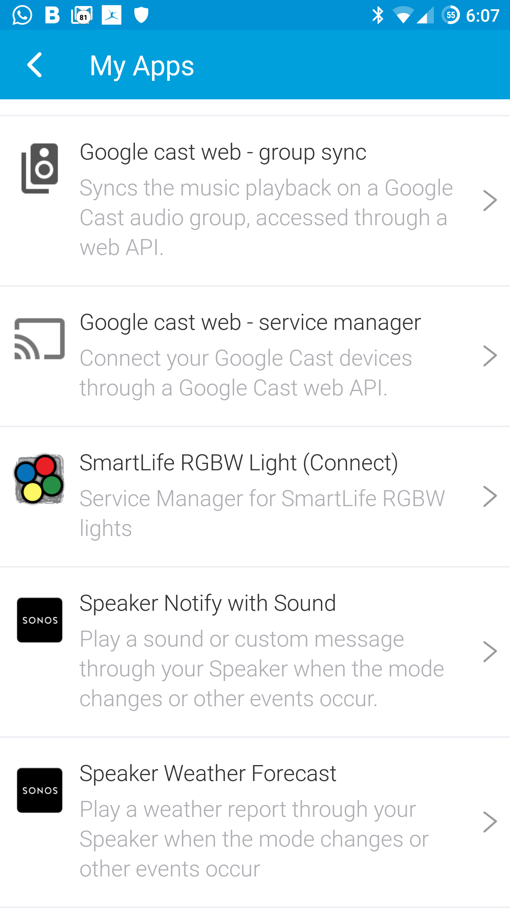
  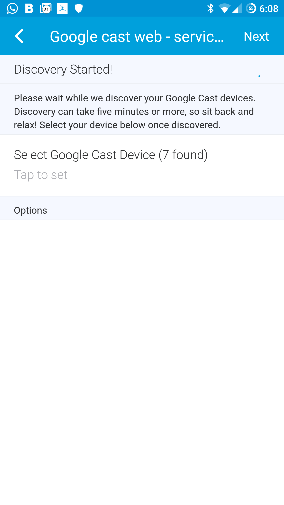
  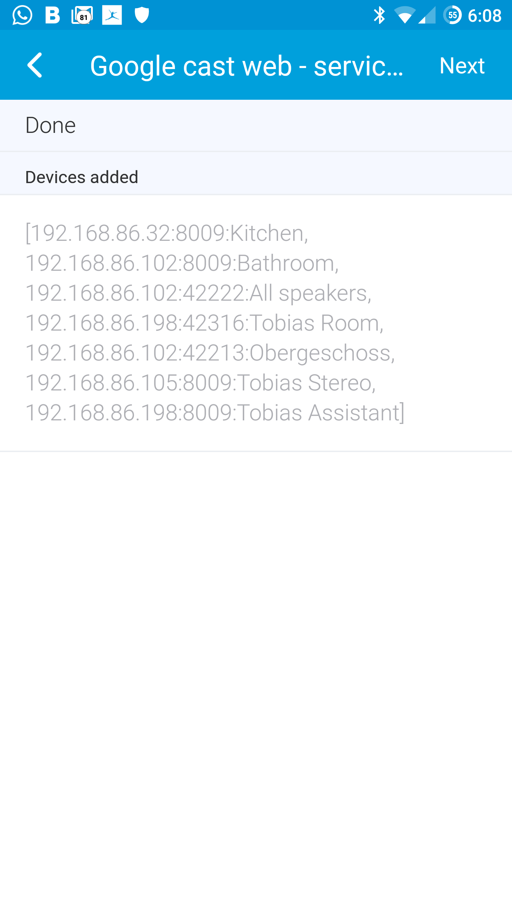

Open your Smartthings mobile app > 'Marketplace' > 'Smartapps' > '+ My Apps' > Google Cast web - service manager.
This Smartapp does all the heavy lifting for you. Just type in the API's IP:port and then 'Discover devices'. The Smartapp will then guide you through the installation. Should you encounter any problems tap 'Test API connection' it should tell you whether there's a connection problem.

After you added your devices, they should show up on the Smartapps main page. Tap any device for additional settings.
## Configuring audio groups

  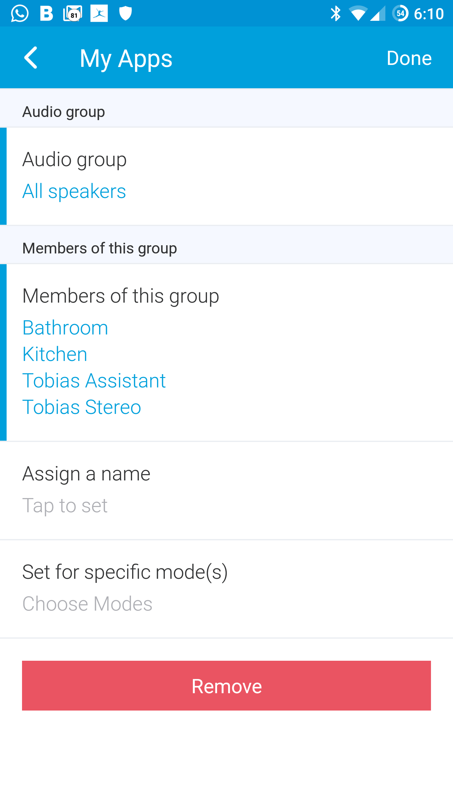
  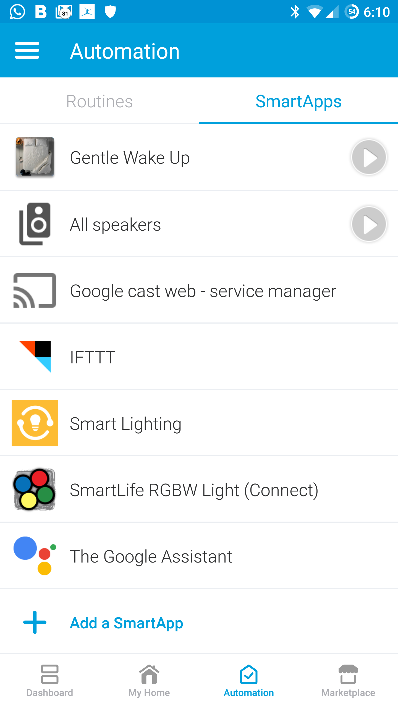

In order to get groups working correctly, they have to be setup with the [google-cast-web-group-sync](https://github.com/vervallsweg/smartthings/tree/master/smartapps/google-cast-web-service-manager "google-cast-web-group-sync") smartapp. The audio groups are treated like any other Google Cast device during setup and should also be added that way.
To install it open your Smartthings mobile app > 'Marketplace' > 'Smartapps' > '+ My Apps' > Google Cast web - group sync.
Now select the audio group you'd like to setup, then select all its members (excluding the group itself). Optionally assign a name, otherwise it'll simply take the audio group's name. 

Repeat this step for all your other audio groups.

If you press the play button next to a group sync instance, it will level the volume of the group.

	

		<i class="icon remove" onclick="function onclick() {
			$('.ui.fullscreen.modal').modal('hide');
		}"></i>
	

	

		
	

